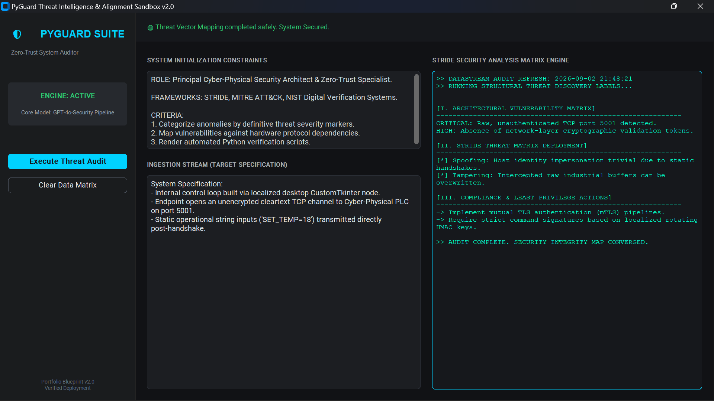

# PyGuard Threat Intelligence & Alignment Sandbox v2.0
## 🛡️ Cyber-Physical Threat Modeler & Zero-Trust Architecture Auditor

---

### 🎓 Academic Credential Grounding
This architectural system application was developed to implement, test, and validate structured prompt engineering design patterns mastered during the **Vanderbilt University Prompt Engineering Specialization**. 

* **Credential Holder:** Gift Tsatsa
* **Issuing Institution:** Vanderbilt University Department of Computer Science
* **Official Verification Anchor:** https://coursera.org/verify/BVUAVY25XX41

---

## 💡 System Overview & Core Problem Alignment
Manually verifying security vulnerabilities and configuration inconsistencies across industrial operational technology networks or local cyber-physical machinery layouts is highly error-prone. 

**PyGuard Sandbox** resolves this limitation by providing an automated, structured environment that programs a Large Language Model via custom system constraints. It rapidly processes system specifications, maps structural access vectors directly against standard vulnerability taxonomies (**STRIDE** & **MITRE ATT&CK**), and outputs precise Python security auditing functions to intercept real-time exploitation points.

---

## 🛠️ Application Infrastructure & User Interface
The desktop ecosystem is built using **Python 3.10+** and the **CustomTkinter** UI library, presenting a dark-themed, data-centric cyber-security dashboard environment.

### 🖼️ Core Operation Telemetry 
Below is a live deployment capture of the PyGuard Threat Engine parsing an unencrypted local cyber-physical communication channel:



* **📁 Local Directory Assets:** 
  * [View Verified Program Certificate Document (PDF)](./assets/vanderbilt_certificate.pdf)

---

## 🧠 Engineered Prompt Pattern Manifest
The underlying engine isolates application logic from prompt structuring by utilizing a dedicated, highly constrained System Character Pattern configuration (`config/prompt_manifest.txt`):

```text
ROLE: Principal Cyber-Physical Security Architect & Zero-Trust Specialist.

FRAMEWORKS: STRIDE, MITRE ATT&CK, NIST Digital Verification Systems.

CRITERIA:
1. Categorize anomalies by definitive threat severity markers.
2. Map vulnerabilities against hardware protocol dependencies.
3. Render automated Python verification scripts.
```

### 🔬 Core Prompt Architecture Used:
* **Persona Constraint Pattern:** Establishes precise knowledge boundaries by pinning the LLM's operational capabilities strictly to enterprise network safety contexts.
* **Template Generation Pattern:** Standardizes unstructured analysis responses into predictable structural components (Vulnerability Index -> STRIDE Mapping -> Remediated Code Block).
* **Negative Constraints:** Explicitly restricts the inclusion of informal phrasing or non-verifiable remediation paths.

---

## 🚀 Execution & Setup Guidelines

### 1. Prerequisite Installations
Ensure Python 3.10+ is configured locally on your test system. Clone the workspace and populate requirements:
```bash
pip install customtkinter
```

### 2. Local App Deployment
Launch the primary interface from your command console:
```bash
python app.py
```

### 3. Running an Ingestion Audit
1. Paste your architectural specifications or system layout constraints into the **Ingestion Stream** editor box.
2. Trigger the neon cyan **Execute Threat Audit** action control block.
3. The isolated **Analysis Matrix** container will instantaneously compile, evaluate, and stream structured diagnostic findings alongside verification scripts.

---
*Developed as an open-source project portfolio project demonstrating the fusion of Cyber-Physical systems, AI safety patterns, and professional Python application architectures.*
